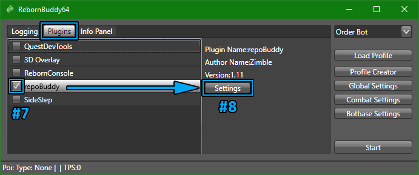

# Getting Started

[RebornBuddy][rebornbuddy] is a customizable bot for Final Fantasy XIV. It automates tedious gameplay like grinding or mass crafting, allowing you to relax or even AFK while it does your bidding.

Add-ons are the lifeblood of RebornBuddy -- the bot is almost useless without them. Luckily, there are plenty of free and paid [community add-ons][downloads] to do almost anything. If not, you can always create or commission your own [custom add-ons][devs-guide]!

This page will cover buying and installing RebornBuddy itself, then getting popular add-ons for a good start.

## Buying RebornBuddy

RebornBuddy works off a monthly subscription and product keys are available on [RebornBuddy.com][rebornbuddy]. Unlike FF14's own subscription where you endlessly top-up the same account, RebornBuddy keys disposable and you simply get a new one as they expire. This also means it won't auto-renew and charge you unexpectedly.

Keys are available in 1 or 6 month increments and with 1 or 3 simultaneous sessions. Multi-session keys let you log into the bot multiple times at once, such as when multi-boxing or splitting costs with trusted friends. The bot generally costs less when buying more months or sessions at once.

???+ tip "Can't find your RebornBuddy key?"
    Keys are delivered in a e-mail titled "RebornBuddy Key Purchase" -- wait a bit longer or check junk mail folders. If the e-mail is still missing and you've already registered on Buddy Auth, it might be available on the [Keys][list-keys] page.

    For further support, create a ticket on [RebornBuddy's ZenDesk][rebornbuddy-support].

After getting your key, register on [Buddy Auth][buddyauth] with the same e-mail used to purchase for access to key and [session management][list-sessions] -- useful if the bot crashes and prevents logins due to "max sessions". If your new key isn't already listed under the [Keys][list-keys] tab, simply add it to your Buddy Auth account under the [Attach Key][attach-key] tab.

[list-keys]: https://eu.buddyauth.com/User/Keys "Keys"
[list-sessions]: https://eu.buddyauth.com/User/Sessions "Sessions"
[attach-key]: https://eu.buddyauth.com/User/AttachKey "Attach Keys"

## Installing RebornBuddy

1. Download [RebornBuddy][rebornbuddy-download].
2. **Before** extracting, [unblock the `.zip` file][unblock-zip] to avoid issues later.
3. Extract RebornBuddy to a known location.
4. In Windows Defender, [exclude the entire RebornBuddy folder][defender-exclusion].

    ??? warning "On Anti-Virus Exclusions"
        Please be safe and use critical thinking when excluding things from anti-virus. RebornBuddy is probably okay and doesn't trigger [VirusTotal][virus-total], but this is your own informed choice to make. In this case, Windows Defender dislikes that RebornBuddy (necessarily) interferes with FF14's memory, so excluding it will save you the pain of `RebornBuddy.exe` being quarantined/deleted every update.

5. While fully logged into a character, launch `RebornBuddy.exe`.
6. Insert your product key and click ++"Login"++:

    

7. Wait for the bot to fully load and logs to stop scrolling.

    

If you've made it this far without incident, congratulations! The next step is installing key add-ons so the bot is actually useful.

[virus-total]: https://www.virustotal.com/gui/home/upload "VirusTotal"

## Installing RepoBuddy and Other Add-Ons

[RepoBuddy][repobuddy] is recommended to easily install and automatically update all types of add-ons. It includes the most popular stuff by default, so RepoBuddy is probably the only plugin most users need to install manually.

1. Close RebornBuddy if it's already running.
2. Install [Microsoft Visual C++ 2010 SP1][vcredist-x64]. Choose the `vcredist_x64.exe` version.
3. Download [`repoBuddy-master.zip`][repobuddy-zip].
4. **Before** extracting, [unblock the `.zip` file][unblock-zip] to avoid issues later.
5. Extract RepoBuddy to `RebornBuddy\Plugins\`, **removing `-master`** so it looks like:
    ```
    RebornBuddy
    └── Plugins
        └── repoBuddy
            ├── repoBuddy.cs
            └── ...
    ```
6. Launch RebornBuddy.
7. In the ++"Plugins"++ tab, enable "repoBuddy" and wait for the bot to restart.
8. Click the "repoBuddy" line, then the ++"Settings"++ button to the right.

    

9. Under ++"One-Time Downloads"++, install "Magitek" and "Lisbeth".
10. At the top, click "Restart RebornBuddy".

    

11. Wait for installation to finish and the logs to show:
    ```
    [repoBuddy] RB fully loaded!
    ```

You now have most everything needed to use RebornBuddy like a pro, including automatic updates!

For a full list of add-ons that may not be included with RepoBuddy, see the [Downloads][downloads] page and subsequent READMEs.

[vcredist-x64]: https://www.microsoft.com/en-us/download/details.aspx?id=26999 "VC++ 2010 SP1"
[repobuddy-zip]: https://github.com/Zimgineering/repoBuddy/archive/master.zip "repoBuddy-master.zip"
