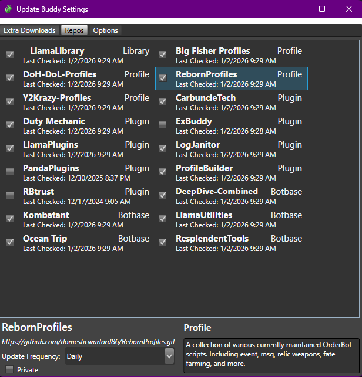

# Getting Started

[RebornBuddy][rebornbuddy] is a customizable bot for Final Fantasy XIV. It automates tedious gameplay like grinding or mass crafting, allowing you to relax or even AFK while it does your bidding.

Add-ons are the lifeblood of RebornBuddy -- the bot is almost useless without them. Luckily, there are plenty of free and paid [community add-ons][downloads] to do almost anything. If not, you can always create or commission your own [custom add-ons][devs-guide]!

This page will cover buying and installing RebornBuddy itself, then getting popular add-ons for a good start.

## Buying RebornBuddy

RebornBuddy requires a monthly subscription and product keys are available on [RebornBuddy.com][rebornbuddy]. Unlike the game's own subscription, where you endlessly top-up the same account, RebornBuddy keys disposable and you simply get a new one as they expire. This also means it won't auto-renew and charge you unexpectedly.

Keys are available in 1 or 6 month increments and with 1 or 3 simultaneous sessions. Multi-session keys let you log into the bot multiple times at once, such as when multi-boxing or sharing keys with trusted friends. The bot generally costs less when buying more months or sessions at once.

???+ question "Can't find your RebornBuddy key?"
    Keys are delivered in an e-mail titled "RebornBuddy Key Purchase" -- wait a bit longer or check junk mail folders. If the e-mail is still missing and you're already registered on Buddy Auth, the new key might be available on the [Keys][list-keys] page.

    For further support, create a ticket on [RebornBuddy's ZenDesk][rebornbuddy-support].

## Registering on Buddy Auth

After buying, register on [Buddy Auth][buddyauth] with the same e-mail used during purchase.  This site offers key lists and [session management][list-sessions] -- useful if the bot crashes and prevents logins due to "max sessions". If your new key isn't already listed under the [Keys][list-keys] tab, simply add it to your Buddy Auth account under the [Attach Key][attach-key] tab.

[list-keys]: https://portal.rebornbuddy.com/User/Keys "Keys"
[list-sessions]: https://portal.rebornbuddy.com/User/Sessions "Sessions"
[attach-key]: https://portal.rebornbuddy.com/User/AttachKey "Attach Keys"

## Installing RebornBuddy

1. Download [RebornBuddy][rebornbuddy-download].
2. **Before** extracting, [unblock the `.zip` file][unblock-zip] to avoid issues later.
3. Extract RebornBuddy to a known location.
4. In Windows Defender, [exclude the entire RebornBuddy folder][defender-exclusion].

    ??? warning "On Anti-Virus Exclusions"
        Please be safe and use critical thinking when excluding things from anti-virus. RebornBuddy is probably okay and doesn't trigger [VirusTotal][virus-total], but this is your own informed choice to make. In this case, Windows Defender dislikes that RebornBuddy (necessarily) interacts with the game's memory, so excluding it will save you the pain of `RebornBuddy.exe` being quarantined/deleted every update.

5. While fully logged into a character, launch `RebornBuddy.exe`.
6. Insert your product key and click ++"Login"++:

    

7. Wait for the bot to fully load and logs to stop scrolling.

    

If you've made it this far without incident, congratulations! The next step is installing key add-ons so the bot is actually useful.

[virus-total]: https://www.virustotal.com/gui/home/upload "VirusTotal"

## Installing UpdateBuddy and Other Add-Ons

??? question "What about RepoBuddy? Can we still use it?"
    RepoBuddy was retired on January 8th, 2024 after [GitHub disabled SVN access][svn-sunset] to git repositories. UpdateBuddy is RepoBuddy's successor -- it supports both public and private git repositories, and sports a much-improved UI for browsing and installing add-ons. It even automatically migrates your existing repos and uninstalls RepoBuddy for you!

1. `updateBuddy` now comes pre-installed with RebornBuddy.
2. Once you have the bot up and running, select the `Plugins` tab across the top and find `updateBuddy` on the list of Plugins. Select it, and then hit the `Settings` button on the right side panel.
3. On the `Repos` tab across the top. Make sure the prerequisites and `RebornProfiles` are selected and `updateBuddy` will download/install/ and update those repos for you.
4. You'll likely also want to check out the `Extra Downloads` tab for important stuff like `Lisbeth` and `Magitek`.

You now have most everything needed to use RebornBuddy like a pro, including auto-updates!

To browse the full list of add-ons that may not have been auto-installed, check ++"Plugins > UpdateBuddy > Settings"++.

[svn-sunset]: https://github.blog/changelog/2024-01-08-subversion-has-been-sunset/
[updatebuddy-zip]: https://loader.updatebuddy.net/UpdateBuddy.zip "Download UpdateBuddy"
